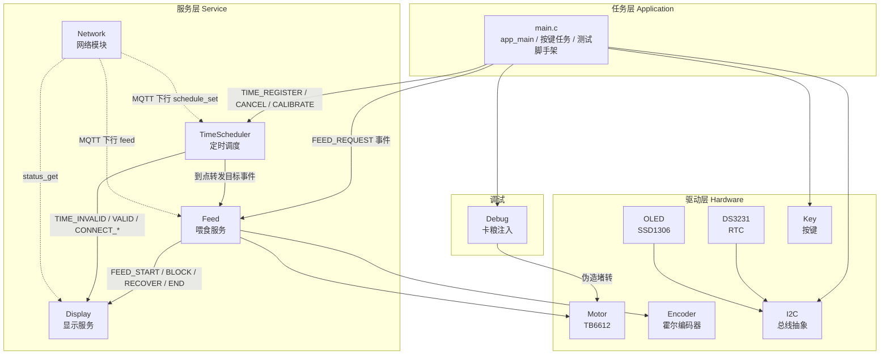

# AutoFeeder · 智能猫粮投喂器固件

基于 **ESP32-S3 + ESP-IDF + FreeRTOS** 的嵌入式固件。用一块 MCU 承担喂食、定时、显示、联网全部功能，
通过**分层架构 + 事件驱动**把「喂食逻辑」与「指令来源」解耦——按键、串口、手机 App 走同一套指令入口，
换传输方式不动业务代码。

> 本仓库是固件代码。设计文档（模块设计、决策日志、真机验证记录）在本地独立维护，见文末《设计文档》。

---

## 一、系统架构



**实线 = 已实现并真机验证；虚线 = 进行中**（网络模块的 MQTT 客户端侧仍是可编译骨架，详见《模块状态》）。

### 分层规则

| 层 | 职责 | 约束 |
|---|---|---|
| 任务层 | 初始化顺序、按键轮询、测试脚手架 | 只发事件，不直接操作驱动 |
| 服务层 | 业务状态机、事件编排 | 服务之间只通过 `esp_event` 通信，不互相 `#include` |
| 驱动层 | 芯片时序、寄存器、总线事务 | 不感知业务语义 |
| 通信层 | 协议编解码、连接管理 | 与指令来源解耦（网络模块 `Client.h` 为契约头，零 include 业务模块） |

### 一次喂食的完整数据流

```
按键单击 / 定时到点 / MQTT 下行
        │  esp_event_post(FEED_EVENTS, FEED_REQUEST, &FdData, ...)
        ▼
Feed_RequestHandler  ← esp_event 回调上下文：只投递，不做任何判断
        │
        ▼
s_FdReqQueue ──► Feed_HandleRequest  ← 喂食任务上下文：立即喂食去重、拒绝回灌
        │
        ▼
s_FdQueue ──► 就绪态取出作业 ──► 运行态：PWM 驱动电机 + 编码器计数闭环
                                       │
                     ┌─────────────────┴─────────────────┐
                     ▼                                   ▼
              转数到达 → 收尾 → FEED_END          连续 5 拍无脉冲 → 异常态
                                                         │
                                              反转清障 → 正转越锚点验证
                                                         │
                                          成功 → 回运行态续跑；3 次失败 → FEED_BLOCK
```

---

## 二、模块状态

### 驱动层

| 模块 | 路径 | 职责 | 状态 |
|---|---|---|---|
| **I2C 总线** | `components/Hardware/I2C/` | 总线事务与设备注册分层；`I2C_DEVICE_GENERIC_REGISTER` 宏生成设备读写接口；超时自愈重探 | ✅ 已实现，真机验证 |
| **DS3231** | `components/Hardware/DS3231/` | RTC 读写、BCD 转换、突发读保证取时原子性、OSF 时间有效性判定 | ✅ 已实现，真机验证 |
| **OLED** | `components/Hardware/OLED/` | SSD1306 128×64 硬件 I2C；逐页写（兼容 SH1106）；中文字库 + UTF-8 解析 | ✅ 已实现，真机验证 |
| **Encoder** | `components/Hardware/Encoder/` | 霍尔编码器 A 相双沿计数、B 相判向；脉冲数 → 输出轴圈数换算 | ✅ 已实现，实测标定 **1400 脉冲/输出圈** |
| **Motor** | `components/Hardware/Motor/` | TB6612 PWM 调速 + 方向控制 | ✅ 已实现，真机验证 |
| **Key** | `components/Hardware/Key/` | 位掩码注册多按键、沿检测、单击/长按 | ✅ 已实现，真机验证 |

### 服务层

| 模块 | 路径 | 职责 | 状态 |
|---|---|---|---|
| **Feed** 喂食服务 | `components/Service/Feed/` | 状态机（就绪→运行⇄异常→结束）；两层队列；立即喂食去重；卡粮检测与两段式反转自愈；堵粮公共守卫 | ✅ 已实现，真机验证 |
| **TimeScheduler** 定时调度 | `components/Service/TimeScheduler/` | 小根堆管理多组预约；`esp_timer` 单定时器随根变重设；循环预约到期自续；暂停态按请求类型分派 | ✅ 已实现，**7 组真机用例全部通过**；任务栈峰值 ≈ 1.5 KB / 4 KB |
| **Display** 显示服务 | `components/Service/Display/` | 多来源显示槽 + 优先级仲裁；事件→内容映射表；可变 tick 与文本帧动画 | ✅ 已实现，真机验证 |
| **WiFi** | `components/Service/Network/Wifi.c` | 意图寄存器 + 候选凭据同步原语；五态状态机；指数退避永续重连 1/2/4/8/16/30 s 封顶；凭据自管 NVS（GOT_IP 后条件提交） | ✅ 已实现，真机验证（含 AP 消失 7 分钟恢复、凭据类失败单次判定） |
| **Client / MqttBackend** | `components/Service/Network/Client.c`、`MqttBackend.c` | MQTT 客户端侧：下行注册表 + 上行直推、五态连接管理、事件/请求双信箱、离线事件补发 | 🚧 **进行中**：`MqttBackend` 事件转发与建连已可用；`Client` 为可编译骨架（结构 + TODO） |
| **Debug** 调试注入 | `components/Debug/` | 真停电机模拟卡粮；单向/双向两种场景；按键轮转触发 | ✅ 已实现，真机验证 |

### 量化记录

| 指标 | 实测值 |
|---|---|
| 编码器标定 | 1400 脉冲/输出圈（7 PPR × 100 减速比 × 2 双沿） |
| 喂食闭环 | 目标 30 g 折算 → 实测出粮 3.032 圈 / 4245 脉冲，与折算值吻合 |
| 定时调度栈水位 | 峰值 ≈ 1.5 KB / 4096 B |
| 固件体积 | app 分区约 852 KB / 1 MB（余约 19%） |
| 定时真机用例 | 7 组全通过（拒绝 / 同刻 / 覆盖与全清 / 堆满 / 错过处置 / 暂停两态） |

> 说明：克重由「克/圈」常数折算，闭环保证的是**转数一致**；该常数尚未经电子秤标定，绝对重量精度取决于它。

---

## 三、硬件

| 项目 | 选型 |
|---|---|
| 主控 | GOOUUU ESP32-S3-CAM（板载摄像头与电机/编码器引脚冲突，不启用） |
| 出粮机构 | 定量轮 + 粮仓搅拌扇叶，单电机同轴驱动 |
| 电机 | GA12-N20 6V 减速比 1:100 + TB6612FNG 驱动 |
| 位置反馈 | 电机尾部 5 线霍尔编码器（A/B 相） |
| 实时时钟 | DS3231（I2C） |
| 显示 | SSD1306 128×64 OLED（I2C，与 RTC 共总线） |
| 电源 | YD-UPS-IP5306 综合板（充电 + 电源路径 + 保护） |

### 引脚分配

| 功能 | GPIO |
|---|---|
| 电机 PWM（PWMA） | 10 |
| 电机方向（AIN1 / AIN2） | 11 / 12 |
| 编码器 A / B 相 | 16 / 17 |
| 喂食按键 | 9 |
| 调试模式按键 | 8 |
| I2C SCL / SDA | 47 / 21 |

---

## 四、构建与烧录

```bash
# 需要 ESP-IDF v6.1
. $IDF_PATH/export.sh          # Windows: %IDF_PATH%\export.bat
idf.py set-target esp32s3
idf.py build
idf.py -p <PORT> flash monitor
```

依赖由组件管理器声明（见 `components/Service/Network/idf_component.yml`）：
`espressif/mqtt`、`espressif/cjson`；TLS 用 `mbedtls` 的证书包。

---

## 五、工程约定

本项目在编码前先做设计评审，落成文档后再写代码。几条沉淀下来的约定：

| 约定 | 说明 |
|---|---|
| **回调只投递不阻塞** | `esp_event` 回调里不做判断、不碰驱动，一律投递到模块队列，由模块任务处理 |
| **状态机「动作/转移」分离** | 动作函数每 tick 返回结果码，转移规则集中评估，避免状态判断散落在各处 |
| **`esp_event` 是值拷贝** | 深拷贝只拷 `sizeof(payload)` 字节：字符串须带 `'\0'` 且传静态/字面量；指针成员会悬垂 |
| **中断/回调共享变量** | 必须 `volatile`；跨任务数据用队列或临界区，不用裸全局 |
| **错误处理分层** | 驱动层原样透传 `esp_err_t`（`!= ESP_OK`），不吞错误；业务层决定重试或上报 |
| **宏参数只求值一次** | 先落局部变量再判断，并用 `do { } while(0)` 包成单语句 |
| **真机验证才算完成** | 每个模块都要有真机用例；异常路径用注入式故障测试覆盖，不靠推演 |

---

## 六、开发状态与路线

```
✅ 驱动层          I2C / DS3231 / OLED / Encoder / Motor / Key
✅ 服务层·喂食     状态机 + 编码器闭环 + 卡粮自愈
✅ 服务层·定时     小根堆 + esp_timer + 7 组真机用例
✅ 服务层·显示     多来源仲裁 + 动画
✅ WiFi 链路       状态机 + 退避重连 + 凭据 NVS
🚧 网络模块        MQTT 客户端（Client / MqttBackend）—— 协议与结构已定稿，实现中
⬜ BLE 配网        自研最小 GATT 协议，排期后置
⬜ 电源管理        深度睡眠 + 按需唤醒
⬜ 红外检测        出粮计数 / 堵塞判断
```

---

## 七、设计文档

设计文档（模块设计、决策日志、真机验证记录）与代码分开维护，不在本仓库内：

| 文档 | 内容 |
|---|---|
| 喂食服务设计 | 状态机、事件族、两层队列、堵粮守卫、红外窗口 |
| 定时调度服务设计 | 堆结构、批量删除算法、到点与错过处置、回查决策 |
| 网络模块设计 | 协议 v1（信封 + 三张表）、连接状态机、内部结构 §11 |
| WiFi 模块设计 | 控制面原语、状态机、凭据 NVS 方案、退避策略 |
| I2C / DS3231 / OLED 驱动设计 | 总线分层、寄存器配置清单、写策略 |
| 决策日志 / 实现留档 | 重大决策 + 被推翻方案的论证；实现史与踩坑史 |

其中「被推翻方案的论证」（如定时续期从喂食收尾回灌改为调度器内部自续、
WiFi 试连从单槽事务改为候选凭据原语）是这套文档最有价值的部分。
